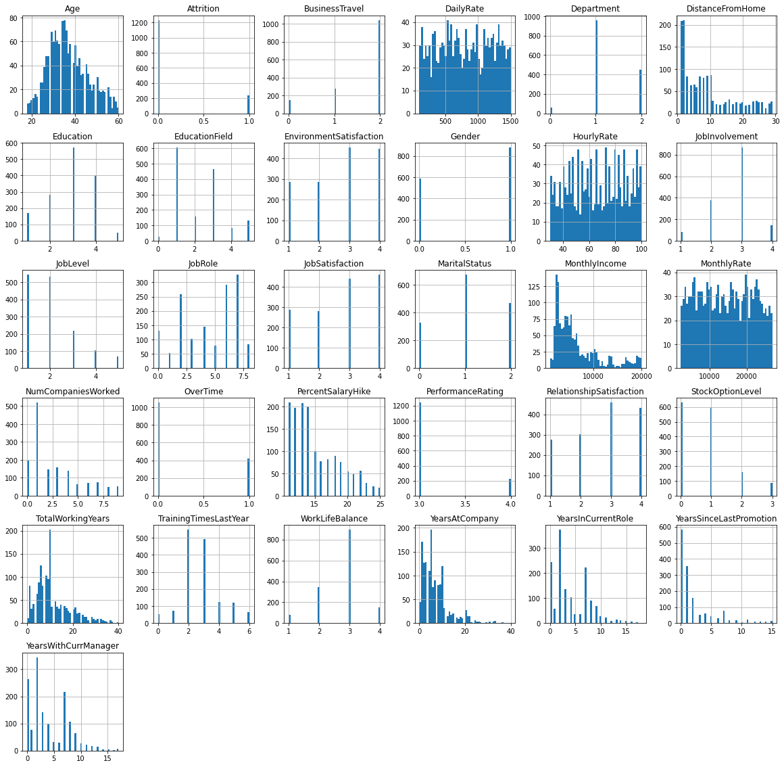
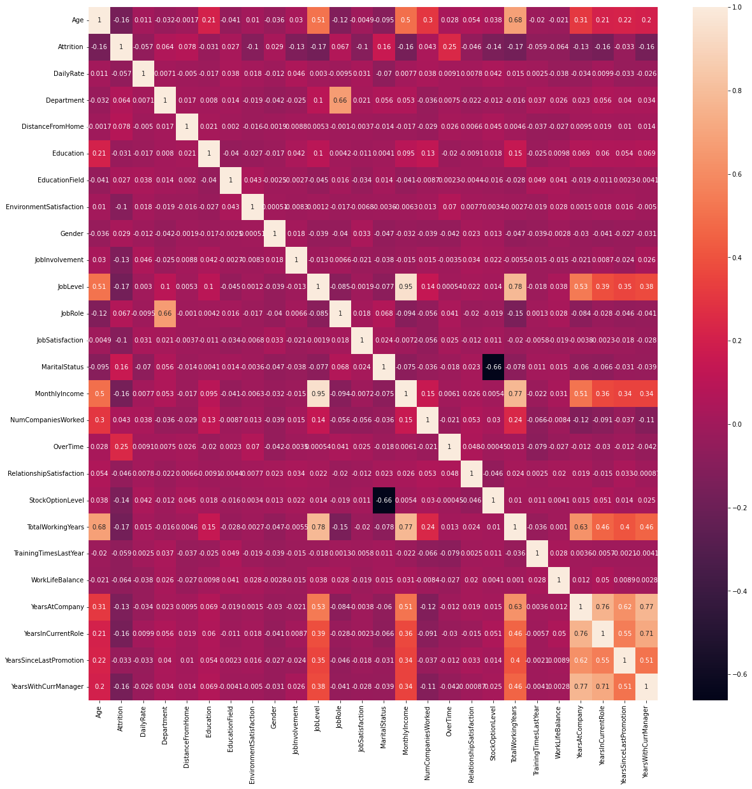
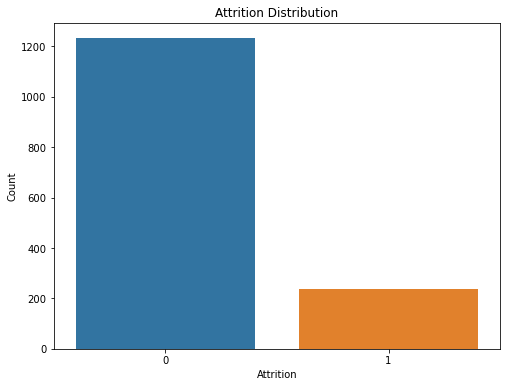
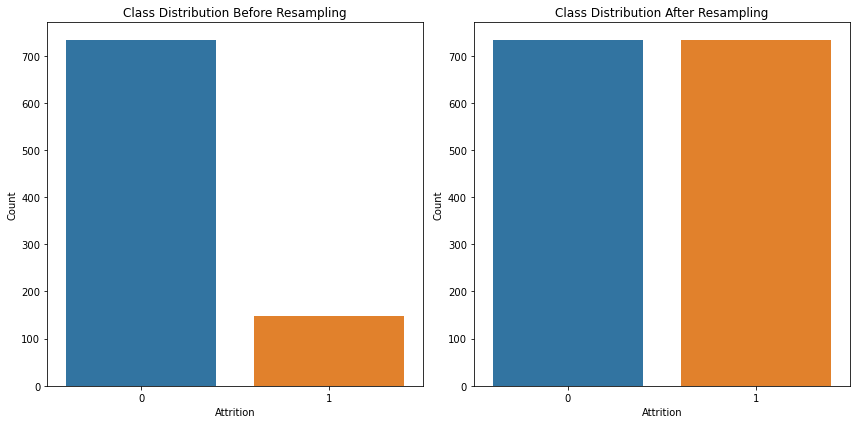

# Employee Attrition Prediction 🔮🏃‍♂️

## 🙇‍♂️ Problem definition and motivation
Employee attrition, or the rate at which employees leave a company, is a significant concern for organizations due to the high costs associated with hiring and training new employees. According to recent data, the average cost per hire rose to $4,700 in 2023. For specialized positions such as cybersecurity, engineering, or nursing, the cost per hire can be even higher, reaching up to $28,329 for executive positions. These costs, combined with factors such as ultra-low unemployment rates and an aging workforce, highlight the importance of predicting and mitigating employee attrition. ([source](https://toggl.com/blog/cost-of-hiring-an-employee)). 
 
By developing a machine learning model that can predict employee attrition, organizations can take proactive measures to retain valuable talent and reduce turnover costs. This project aims to leverage machine learning techniques to analyze factors such as job satisfaction, salary, work-life balance, etc., and predict which employees are most likely to leave the company. By doing so, organizations can optimize their hiring and retention strategies, ultimately reducing the financial burden of employee turnover.

## 🗂️ Dataset
We used the publicly available dataset on employee attrition: the IBM HR Analytics Employee Attrition & Performance dataset, which contains information about employees' demographics, job role, satisfaction levels, etc. 
Link: https://www.kaggle.com/datasets/pavansubhasht/ibm-hr-analytics-attrition-dataset/data

## ❔ Evaluation metrics
The performance of our machine learning model will be evaluated using metrics such as accuracy, precision, recall, and F1-score.   Given that the classes are imbalanced, we will use <strong>weighted f1-score</strong> as our main metric of evaluation.

## 🧐 Data Exploring
(1) Dataset has 1470 rows and  35 columns.  
(2) Plot histogram for each numeric variable/feature of the dataset.

(3) Check for nulls & duplicates <strong>➺</strong> Total number of duplicates : 0, Total number of missing values : 0 
(4) Get the number of unique values for each column. 
(5) Explore categorical featuresׂ <strong>➺</strong> Total number of categorical variable : 8 
(6) Explore outliers <strong>➺</strong> Print number of outliers in each column. 
(7) Confusion matrix: 

(8) Check data imbalance. 

## 🔧 Preprocessing

1- Drop ('EmployeeCount', 'Over18', 'StandardHours') columns as they were found to have constant values for all 1470 rows. Also, 'EmployeeNumber' is a unique identifier for all 1470 rows. 
2- Encode categorical variables. 
3- Remove MonthlyIncome,TotalWorkingYears, YearsInCurrentRole and YearsWithCurrManager taking a cutoff of 0.7 correlation coefficient. This will retain JobLevel and YearsAtCompany and remove possibility of multicollinearity from the features. 
4- Scale the date. 
5- Split The Data into training, validation, and testing sets. 
6- Resampling. 

