# Employee Attrition Prediction 🔮🏃‍♂️

## 🙇‍♂️ Problem definition and motivation
Employee attrition, or the rate at which employees leave a company, is a significant concern for organizations due to the high costs associated with hiring and training new employees. According to recent data, the average cost per hire rose to $4,700 in 2023. For specialized positions such as cybersecurity, engineering, or nursing, the cost per hire can be even higher, reaching up to $28,329 for executive positions. These costs, combined with factors such as ultra-low unemployment rates and an aging workforce, highlight the importance of predicting and mitigating employee attrition. ([source](https://toggl.com/blog/cost-of-hiring-an-employee)). 
 
By developing a machine learning model that can predict employee attrition, organizations can take proactive measures to retain valuable talent and reduce turnover costs. This project aims to leverage machine learning techniques to analyze factors such as job satisfaction, salary, work-life balance, etc., and predict which employees are most likely to leave the company. By doing so, organizations can optimize their hiring and retention strategies, ultimately reducing the financial burden of employee turnover.

## 🗂️ Dataset
We used the publicly available dataset on employee attrition: the IBM HR Analytics Employee Attrition & Performance dataset, which contains information about employees' demographics, job role, satisfaction levels, etc. 
[Link](https://www.kaggle.com/datasets/pavansubhasht/ibm-hr-analytics-attrition-dataset/data)

## ❔ Evaluation metrics
The performance of our machine learning model will be evaluated using metrics such as accuracy, precision, recall, and F1-score.   Given that the classes are imbalanced, we will use <strong>weighted f1-score</strong> as our main metric of evaluation.

## 🧐 Data Exploring
(1) Dataset has 1470 rows and  35 columns.  
(2) Plot histogram for each numeric variable/feature of the dataset.

(3) Check for nulls & duplicates <strong>➺</strong> Total number of duplicates : 0, Total number of missing values : 0 
(4) Get the number of unique values for each column. 
(5) Explore categorical featuresׂ <strong>➺</strong> Total number of categorical variable : 8 
(6) Explore outliers <strong>➺</strong> Print number of outliers in each column. 
(7) Show Correlation Between the target variables and each feature

(8) Confusion matrix: 

(9) Check data imbalance. 

## 🔧 Preprocessing

1- Drop ('EmployeeCount', 'Over18', 'StandardHours') columns as they were found to have constant values for all 1470 rows. Also, 'EmployeeNumber' is a unique identifier for all 1470 rows. 
2- Encode categorical variables. 
3- Remove MonthlyIncome,TotalWorkingYears, YearsInCurrentRole and YearsWithCurrManager taking a cutoff of 0.7 correlation coefficient. This will retain JobLevel and YearsAtCompany and remove possibility of multicollinearity from the features. 
4- Scale the date. 
5- Split The Data into training, validation, and testing sets. 
6- Resampling. 

## Models

### Zero-R model (baseline model):

### AdaBoost

**Performing grid search to get the best parameters:**

**Parameters of Best Model:**

**Evaluation metrics on Validation Set:**

**Classification report for validation set:**

**Confusion Matrix for validation set**

**Learning Curve (Scores)**

**Learning Curve (errors)**

**AdaBoost Learning Curve Insights:**

• The decreasing training score suggests that as more training examples are provided, the model is exposed to a wider variety of instances and is learning to generalize better.

• This is a positive sign as it indicates that the model is not memorizing the training data but rather learning meaningful patterns.

• The increasing validation score indicates that the model's performance on unseen data is improving as more training examples are provided.

• This suggests that the model is generalizing well to new instances and is not overfitting to the training data.

• The small gap between the training and validation scores suggests that the model is not suffering from significant overfitting.

• The fact that both scores are increasing with a small gap indicates that the model is learning to generalize well to unseen data without excessively fitting to the training data.

• The fact that both the training and validation scores are eventually increasing slowly that the model's performance is stabilizing as more data is provided.

• This is a desirable outcome, indicating that additional data may not significantly improve the model's performance further.

**Training & Validation errors vs number of learning estimators:**

• Boosting is often robust to overfitting.

• Test set error decreases even after training error is almost zero

**After Training over all the data (training + validation):**

**Classification Report for Test Set:**

**Confusion Matrix for Testset:**

---

### Logistic Regression

**Performing grid search to get the best parameters:**

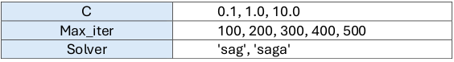

**Parameters of Best Model:**

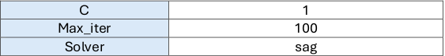

**Evaluation metrics on Validation Set:**

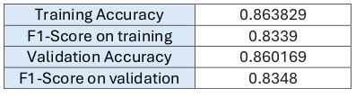

**Classification report for validation set:**

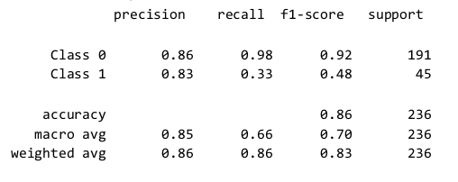

**Confusion Matrix for validation set**

**Learning Curve (Scores)**

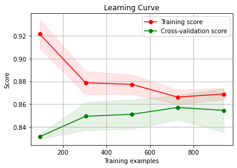

**Learning Curve (errors)**

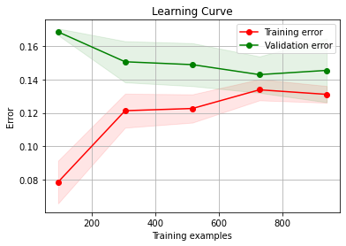

**LogisticRegression Learning Curve Insights:**

• The decreasing training score suggests that as more training examples are provided,
the model is exposed to a wider variety of instances and is learning to generalize better.
This is a positive sign as it indicates that the model is not memorizing the training data but
rather learning meaningful patterns.

• The increasing validation score indicates that the model's performance on unseen data is improving as more training examples are provided. This suggests that the model is generalizing well to new instances and is not overfitting to the training data.

• The small gap between the training and validation scores suggests that the model is not suffering from significant overfitting. The fact that both scores are increasing with a small gap indicates that the model is learning to generalize well to unseen data without excessively fitting to the training data.

**After Training over all the data (training + validation):**

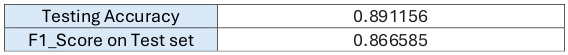

**Classification Report for Test Set:**

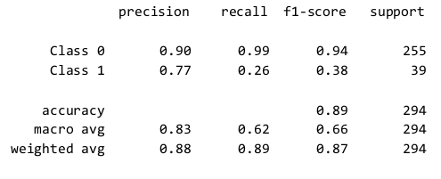

**Confusion Matrix for Testset:**

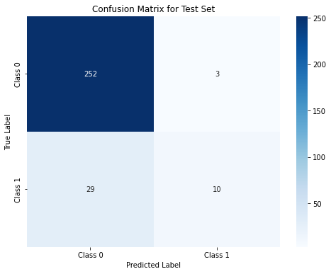

---

### SVM

**Performing grid search to get the best parameters:**

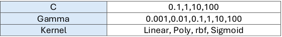

**Parameters of Best Model:**

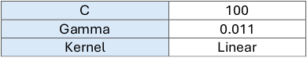

**Evaluation metrics on Validation Set:**

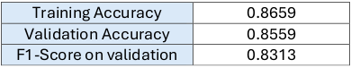

**Classification report for validation set:**

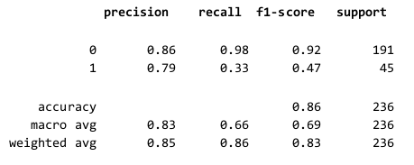

**Gamma vs Error:**

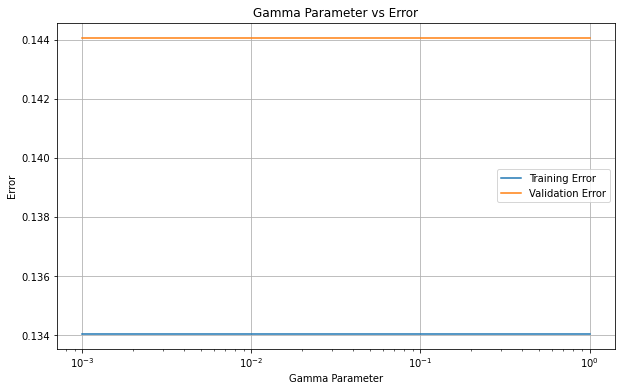

Changing the gamma parameter does not significantly affect the model's performance on either the training or validation data.

**C vs Error:**

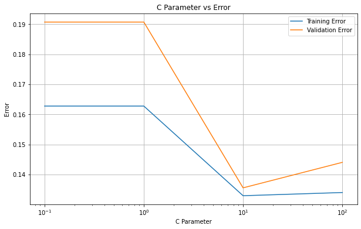

-**Initial Decrease**: At lower values of C, both the training and validation errors decrease. This indicates that the model is underfitting.

-**Optimal C Value**: There is a point where the validation error reaches its minimum value, indicating the best regularization parameter (C) for the model where the model achieves the best balance between bias and variance, leading to optimal generalization to unseen data.

-**Increase after Optimal C**: Beyond the optimal C value, both the training and validation errors start to increase. This is because higher values of C lead to overfitting, where the model becomes too complex.

**Learning Curve(scores):**

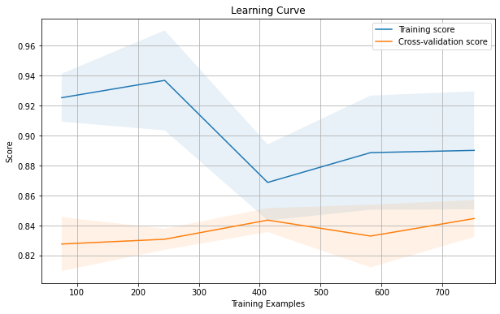

**Learning Curve(errors):**

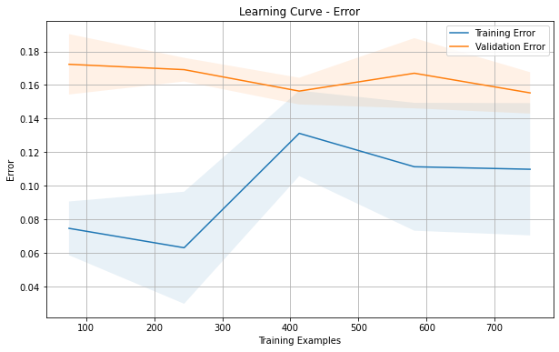

- The decreasing validation score indicates that the model's performance on unseen data is not improving as more training examples are provided.

- This suggests that the model is not generalizing well to new instances and is not overfitting to the training data.

- The gap between the training and validation scores is not small which suggests that the model is suffering from overfitting.

  Overall, the learning curve suggests that the model's performance improves with more training examples up to a certain point, after which further increases in the training set size may lead to overfitting. It highlights the importance of balancing model complexity and dataset size for optimal performance.

- Because of this overfitting i started to perform regularization by choosing the
optimal value for C.

We plotted the C vs Error again but this time we appended smaller values to the C list. Then We plotted the Learning curve again to ensure that the overfitting is solved.

**C vs Error:**

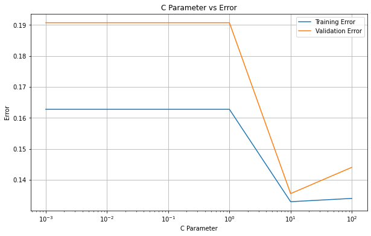

_Optimal C value=10_

**Learning Curve after regularization:**

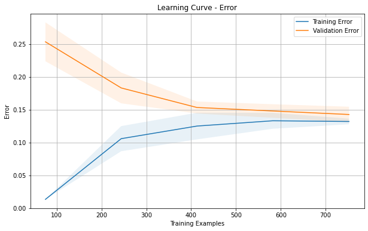

Overfitting Solved.

**Evaluation metrics After Regularization:**

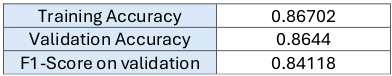

**Classification report for validation set after regularization:**

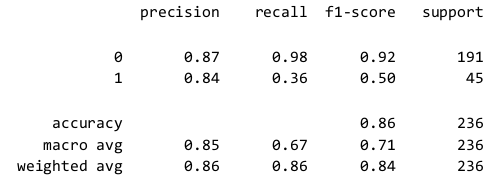

**Confusion Matrix for validation set After Regularization:**

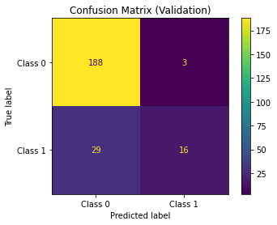

**Metrics on test set:**

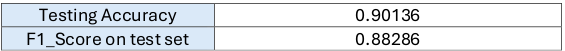

**Classification Report on test set:**

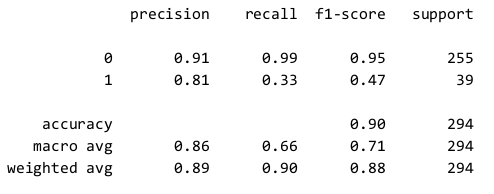

**Confusion Matrix for Test set:**

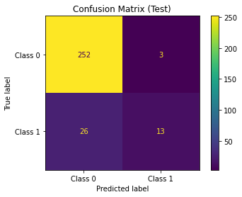

---

### Linear SVM:

## Models Results:

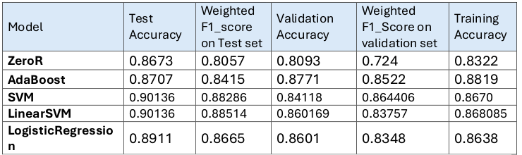
